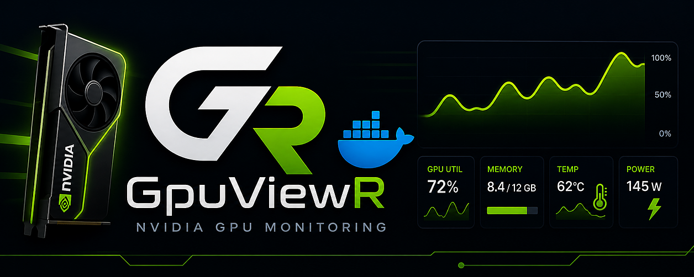
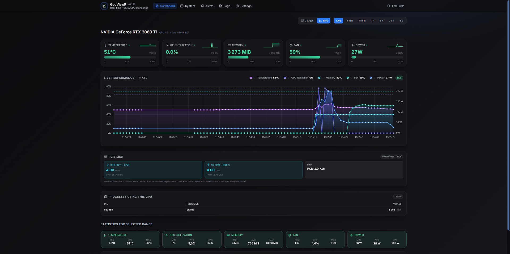

# GpuViewR, NVIDIA & AMD GPU Dashboard

<div align="center">



[](https://github.com/Erreur32/GpuViewR/releases)


[](LICENSE)

[](https://scorecard.dev/viewer/?uri=github.com/Erreur32/GpuViewR)
[](https://github.com/Erreur32/GpuViewR/security/code-scanning)
[](https://github.com/Erreur32/GpuViewR/actions/workflows/snyk.yml)
[](https://sonarcloud.io/summary/overall?id=Erreur32_GpuViewR2)

**Real-time GPU monitoring dashboard, NVIDIA + AMD, single Docker image.**

</div>

> 🧠 **Built for AI / LLM workloads.** GpuViewR is designed first for
> boxes running local language models and AI inference, **Ollama**,
> **llama.cpp**, **vLLM**, **ComfyUI**, **Stable Diffusion**, **KoboldCpp**,
> **text-generation-webui**, **LM Studio**, etc. See VRAM, utilization,
> temperature and per-process compute across your whole fleet, in real
> time. Works just as well for gaming/render boxes, the LLM focus is
> the design driver, not a hard limit.

<div align="center">

<table>
<tr>
<td align="center" width="25%" height="64"></td>
<td align="center" width="25%" height="64"></td>
<td align="center" width="25%" height="64"></td>
<td align="center" width="25%" height="64"></td>
</tr>
<tr>
<td align="center" valign="top"><b>NVIDIA</b><br/><sub>nvidia-smi + pmon</sub></td>
<td align="center" valign="top"><b>AMD</b><br/><sub>ROCm / sysfs amdgpu</sub></td>
<td align="center" valign="top"><b>Linux</b><br/><sub>systemd / Docker</sub></td>
<td align="center" valign="top"><b>Windows</b><br/><sub> Scheduled Task - PDH</sub></td>
</tr>
</table>

**Multi-host & mixed-fleet.** One hub aggregates any combination of
NVIDIA + AMD GPUs running on Linux (`systemd` binary or Docker
sidecar) and Windows (PowerShell-installed Scheduled Task), see the
whole fleet on a single dashboard, each host coded with its own
colour on every chart.

</div>

<div align="center">

[**Live demo**](https://erreur32.github.io/GpuViewR/) · [**Multi-host demo**](https://erreur32.github.io/GpuViewR/fleet?fleet=1) (synthetic data, runs entirely in the browser)

[Install](#install) · [Configuration](#configuration) · [Add a remote host](#add-a-remote-host) · [Architecture](#architecture) · [Contributing](Docs/CONTRIBUTING.md)

</div>

---

## Screenshot

<div align="center">



</div>

---

## Features

- **NVIDIA + AMD**, auto-detected vendor, both first-class
- **Multi-host**, one hub aggregates N machines via lightweight WS agents
- **One agent → N hubs** (v0.5+), failover or share GPU box across dashboards
- **Multi-GPU** per host
- **Alerts**, sustain + cooldown, Discord / Telegram / MQTT / webhook
- **Exports**, Prometheus / InfluxDB / MQTT
- **i18n**, English / French
- **Single Docker image**, multi-arch (amd64 / arm64), Node 22 trixie-slim

---

## Install

**One command:**

```bash
curl -fsSL https://raw.githubusercontent.com/Erreur32/GpuViewR/main/install.sh | bash
```

`install.sh` auto-detects your GPU vendor (NVIDIA / AMD / none), pulls
`docker-compose.yaml` into the install directory (see below), generates
a `.env` with random JWT + bootstrap secret + LAN IP, and starts the
stack. Done.

Open `http://<your-host-ip>:7510`, first user becomes admin.

### Where it installs

**`cd` to where you want it first**, then run the install command. The
script drops `docker-compose.yaml` + `.env` in the current directory.

```bash
mkdir -p /opt/gpuviewr && cd /opt/gpuviewr
curl -fsSL https://raw.githubusercontent.com/Erreur32/GpuViewR/main/install.sh | bash
```

If you run from a session landing dir (`/`, `$HOME`, `/root`, `/tmp`)
the script falls back to `$HOME/gpuviewr` so it doesn't pollute your
home. Set `GPUVIEWR_INSTALL_DIR=/custom/path` to force a specific
target.

Re-running on an existing install is idempotent: it preserves your
`.env` (secrets stay), pulls the latest compose, restarts the stack.

<details>
<summary>Manual install (if you'd rather not curl-pipe-bash)</summary>

```bash
mkdir -p ~/gpuviewr && cd ~/gpuviewr

curl -fsSL -o docker-compose.yaml \
  https://raw.githubusercontent.com/Erreur32/GpuViewR/main/docker-compose.yaml

cat > .env <<EOF
JWT_SECRET=$(openssl rand -base64 32)
LOCAL_AGENT_BOOTSTRAP=$(openssl rand -base64 32)
HOST_IP=$(hostname -I | awk '{print $1}')
HUB_HOSTNAME=$(hostname)
DASHBOARD_PORT=7510
TZ=Europe/Paris
COMPOSE_PROFILES=nvidia     # or: amd, or empty (= aggregator-only)
EOF
chmod 600 .env

docker compose up -d
```

The `docker-compose.yaml` defines three services: a vendor-neutral
`hub` (always started), plus `agent-nvidia` and `agent-amd` sidecars
gated by `COMPOSE_PROFILES`. Only the right sidecar exists at runtime.

</details>

### Update

```bash
cd ~/gpuviewr
docker compose pull && docker compose up -d
```

### Pre-requisites

- Docker Engine 23+ with the Compose v2 plugin
- **NVIDIA**: [NVIDIA Container Toolkit](https://docs.nvidia.com/datacenter/cloud-native/container-toolkit/install-guide.html)
- **AMD**: amdgpu kernel driver loaded. ROCm at `/opt/rocm` is only needed if you enable `FEATURES=processes` (the sysfs GPU backend reads `/sys/class/drm/` directly, no `rocm-smi` spawn per tick)

---

## First login

GpuViewR ships **without** pre-baked credentials.

1. Open the dashboard URL. An empty database switches the login page to **"Create admin account"**.
2. Pick `username` (≥ 3 chars) and `password` (≥ 8 chars).
3. First user → `admin`. Subsequent registrations → `user`.

**Lost your password?** Wipe the user store and start over:

```bash
docker compose down
rm -rf ./data/gpuviewr.db*
docker compose up -d
```

(GPU history lives in the same SQLite file, so it gets reset too.)

---

<details>
<summary><h2 style="display:inline">Configuration</h2> <sub>(click to expand)</sub></summary>

All settings are read from `~/gpuviewr/.env` (generated by `install.sh`).

| Variable | Default | Purpose |
|---|---:|---|
| `JWT_SECRET` | _required_ | Secret for signing JWTs. Generated by install.sh. |
| `LOCAL_AGENT_BOOTSTRAP` | _generated_ | Shared secret between hub and the local sidecar agent. Leave empty to disable the sidecar (aggregator-only mode). |
| `COMPOSE_PROFILES` | _set by install.sh_ | `nvidia` / `amd` / empty. Switches the local sidecar's vendor. |
| `DASHBOARD_PORT` | `7510` | Host port mapped to the container's `3015`. |
| `HOST_IP` | _auto_ | LAN IP shown in the boot banner. |
| `HUB_HOSTNAME` | _auto_ | Hostname used in the UI for the local host. Wins over `/etc/hostname` auto-detection. |
| `TZ` | `Europe/Paris` | Container timezone. |
| `RETENTION_DAYS` | `7` | How long historical metrics live in SQLite. |
| `PUBLIC_URL` | _none_ | When you put a reverse-proxy in front. |
| `VIDEO_GID` / `RENDER_GID` | `44` / `109` | AMD only. Override if `getent group video render` shows different numbers (ROCm sometimes shifts `render` to 992). |

</details>

---

<details>
<summary><h2 style="display:inline">Add a remote host</h2> <sub>(click to expand)</sub></summary>

Got another machine with a GPU you want monitored by the same hub?

1. On the hub: **Settings → Hosts → + Add host**. Type a label, hit Generate. The modal shows your `HOST_ID` + `AGENT_TOKEN` **once**, copy them.

2. On the remote machine, run:

```bash
curl -fsSL http://<your-hub>:7510/install.sh | sudo bash -s -- \
  --url http://<your-hub>:7510 \
  --token <host_id>.<secret>
```

The hub serves the agent install script directly. Works on
Debian/Ubuntu/RHEL/Rocky/Alma/Fedora; installs Node 22 if missing,
sets up a systemd unit at `/opt/gpuviewr-agent/`.

**`--url` accepts both schemes** (since v0.6.4): `http://`, `https://`,
`ws://`, `wss://`, the script normalises both forms internally
(curl can't speak `ws://`, so it converts to `http://` for the
bundle download, and back to `ws://` for the agent's runtime env).

**Token format:** `<host_id>.<secret>`, the Add Host modal builds it
for you, just copy the whole line. If you only have a bare token
(e.g. one you rotated), prefix it manually with `<host_id>.` from
the hub UI before pasting.

**Docker alternative**: pull `docker-compose.agent.nvidia.yaml` or
`docker-compose.agent.amd.yaml` from this repo onto the remote, fill
in `HUB_URL`/`HOST_ID`/`AGENT_TOKEN` in a `.env`, then
`docker compose up -d`.

**Windows alternative** (NVIDIA only, GPU stats only, since v0.6.7):
the Add Host modal exposes a third **Windows** tab that gives you a
PowerShell snippet:

```powershell
Set-ExecutionPolicy Bypass -Scope Process -Force
$env:GPVR_HUB_URL = 'http://<your-hub>:7510'
$env:GPVR_TOKEN   = '<host_id>.<secret>'
iex (iwr "$env:GPVR_HUB_URL/install.ps1" -UseBasicParsing).Content
```

Paste it in an **elevated** PowerShell. Requires Node 22+ and the
standard NVIDIA driver (`nvidia-smi.exe`). The installer registers a
SYSTEM-level Scheduled Task that survives reboots and supervises the
agent in a while-loop. AMD on Windows is not supported (no
`rocm-smi`). Process list, CPU/RAM telemetry, and the systemd-style
auto-update *immediate-restart* are skipped for now, see
`agent/README.md` for the long-form notes.

**One agent → multiple hubs** (failover, shared monitoring, etc.):

```env
HUB_URLS=wss://hub1.example.com/agent,wss://hub2.example.com/agent
HOST_IDS=<id-on-hub1>,<id-on-hub2>
AGENT_TOKENS=<token-on-hub1>,<token-on-hub2>
```

The agent maintains parallel WS connections; a buffer is kept per-hub
so a slow hub doesn't gate samples to the others.

### Auto-update (bare-metal only)

For bare-metal (systemd) agents, flip the **Auto-update** toggle in
Settings → Hosts (the circular arrows icon next to Rotate / Delete).
Once enabled, the hub pushes a new `agent.mjs` over the existing WS
in two cases:

- **At agent reconnect** (WS hello), fires immediately when the
  agent's version is older than the hub's.
- **On a periodic scheduler tick** (v0.6.5+), default every hour,
  configurable via `AUTO_UPDATE_CHECK_INTERVAL_MS` env on the hub.
  Catches agents that are stably connected and would otherwise
  never see a new release.

The bundle is verified against the hub-provided SHA256, written
atomically to `/opt/gpuviewr-agent/agent.mjs` (the systemd unit
ships with `ReadWritePaths=/opt/gpuviewr-agent` for this), and the
agent calls `exit(0)`. `Restart=always` brings it back on the new
binary. A 5-minute cooldown protects against crash-loop pile-up
(configurable via `AUTO_UPDATE_COOLDOWN_MS`).

Windows agents also support auto-update from v0.6.7: the bundle is
written to `C:\ProgramData\GpuViewR-Agent\agent.mjs.pending`,
`launcher.ps1` swaps it in atomically on the next supervisor
iteration (≈5 s downtime). Docker agents currently skip auto-update;
upgrade them via `docker compose pull && docker compose up -d`.

The Auto-update toggle's tooltip surfaces the scheduler state per
host: "Last check: 12m ago" / "Last push: → 0.6.5 (3h ago)". For
an on-demand push (bypassing all gates), use the **Update now**
button (download-cloud icon), same row.

Off by default, flipping it on gives the hub binary-execute
authority on the remote machine, so it has to be a conscious admin
decision. Docker agents update through `docker compose pull && up -d`
instead (their bundle lives in the read-only image layer, not a
writable file, so the same trick doesn't apply).

</details>

---

<details>
<summary><h2 style="display:inline">Architecture</h2> <sub>(click to expand)</sub></summary>

```
              ┌─────────────────────┐
              │  Hub (vendor-neutral)│  ~170 MB image
              │  REST + WS + DB + UI │  No python3, no /dev/* devices
              └─────────▲────────────┘
                        │ WS /agent
        ┌───────────────┼─────────────────┐
        │               │                 │
  ┌─────┴─────┐   ┌─────┴─────┐    ┌──────┴──────┐
  │ Local     │   │ Remote    │    │ Remote      │
  │ sidecar   │   │ NVIDIA    │    │ AMD         │
  │ (NVIDIA   │   │ agent     │    │ agent       │
  │  or AMD)  │   │           │    │             │
  └───────────┘   └───────────┘    └─────────────┘
```

The hub speaks zero GPU. Every sample, local or remote, arrives via
the agent WS ingest path. The local sidecar is just another agent that
auto-enrolls on first boot via a shared secret in `.env`.

See [`Docs/V0_5_PLAN.md`](Docs/V0_5_PLAN.md) for the detailed architecture rationale.

</details>

---

<details>
<summary><h2 style="display:inline">Troubleshooting</h2> <sub>(click to expand)</sub></summary>

**"No GPU detected" in the UI**: the local sidecar didn't connect. Check:

```bash
docker compose logs gpuviewr-hub | grep -iE 'vendor|agent'
docker compose logs gpuviewr-hub-agent | tail -20
```

Common cases:
- `COMPOSE_PROFILES` empty in `.env` → no sidecar started. Set it to `nvidia` or `amd` (or re-run `install.sh` and it'll fix this for you).
- AMD: `rocm-smi` exits 0 with empty stdout → permissions on `/dev/kfd` or `LD_LIBRARY_PATH`. The compose defaults work on Debian; override `VIDEO_GID`/`RENDER_GID` if `getent group video render` shows different numbers.
- NVIDIA: container can't see `nvidia-smi` → NVIDIA Container Toolkit not installed on the host.

**UI shows container id instead of hostname**: the `/etc/hostname` bind-mount didn't take effect. Either `down && up -d` after pulling the latest compose (recreates the container), or set `HUB_HOSTNAME=<your-name>` in `.env` to override.

**Stale session after `rm -rf data` reset**: the browser holds a JWT signed by the old `JWT_SECRET`. v0.5.2+ auto-detects this and redirects to `/login?expired=1` with an amber banner. On older builds, manually clear the site's localStorage in DevTools and reload.

</details>


## Roadmap

- v0.6: filesystem handshake to replace the bootstrap shared-secret (one-shot token file, no secret in `.env`)
- v0.6: Windows / macOS install script
- v0.7: ARM agent native binary (no Docker on the remote side)
- v0.7: Multi-card AMD process attribution via `--showpidgpus`
- Later: RBAC, organisation scoping

---

## Contributing

See [`Docs/CONTRIBUTING.md`](Docs/CONTRIBUTING.md). Quick local dev:

```bash
npm install
npm run dev:mock     # synthetic GPU + AMD sidecar fake, no real hardware needed
```

The dashboard listens on `http://localhost:5181`, the API on `:3015`.

License: MIT (see [LICENSE](LICENSE)).
