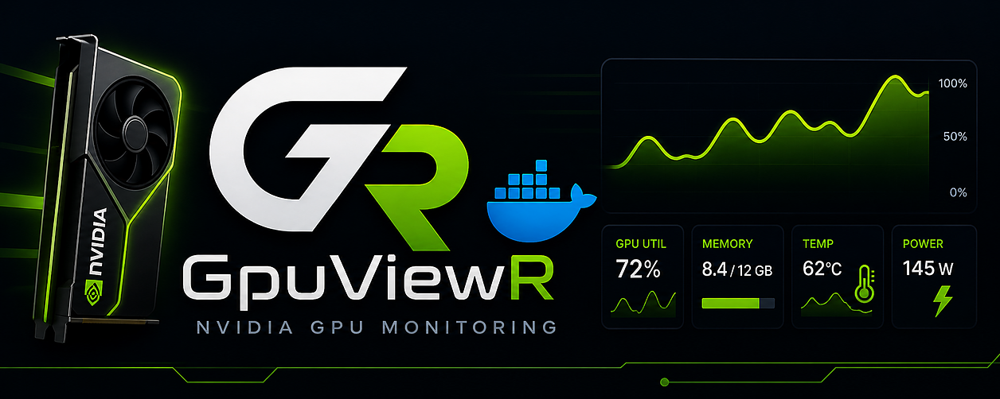
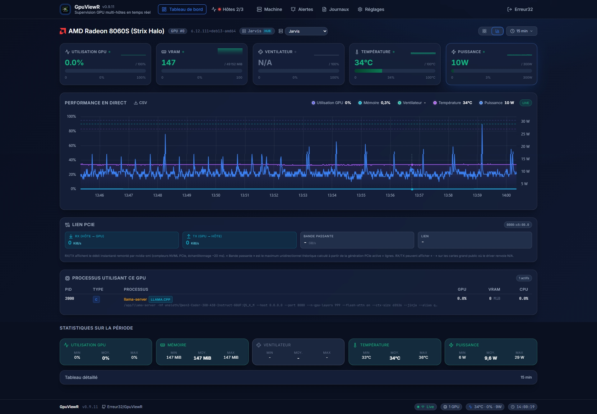

# GpuViewR, NVIDIA & AMD GPU Dashboard

<div align="center">



[](https://github.com/Erreur32/GpuViewR/releases)


[](LICENSE)

[](https://scorecard.dev/viewer/?uri=github.com/Erreur32/GpuViewR)
[](https://github.com/Erreur32/GpuViewR/security/code-scanning)
[](https://github.com/Erreur32/GpuViewR/actions/workflows/snyk.yml)
[](https://sonarcloud.io/summary/overall?id=Erreur32_GpuViewR2)

**Real-time GPU monitoring dashboard, NVIDIA + AMD, single Docker image.**

</div>

> 🧠 **Built for AI / LLM workloads** (Ollama, llama.cpp, vLLM, ComfyUI,
> LM Studio, ...): VRAM, utilization, temperature and per-process usage
> across your whole fleet, in real time. Works just as well for gaming and
> render boxes.

<div align="center">

<table>
<tr>
<td align="center" width="20%" height="64"></td>
<td align="center" width="20%" height="64"></td>
<td align="center" width="20%" height="64"></td>
<td align="center" width="20%" height="64"></td>
<td align="center" width="20%" height="64"></td>
</tr>
<tr>
<td align="center" valign="top"><b>NVIDIA</b><br/><sub>nvidia-smi + pmon</sub></td>
<td align="center" valign="top"><b>AMD</b><br/><sub>ROCm / sysfs amdgpu</sub></td>
<td align="center" valign="top"><b>Linux</b><br/><sub>systemd / Docker</sub></td>
<td align="center" valign="top"><b>Windows</b><br/><sub>Scheduled Task - PDH</sub></td>
<td align="center" valign="top"><b>macOS</b><br/><sub>Apple Silicon - LaunchAgent</sub></td>
</tr>
</table>

**One dashboard for a mixed fleet**: NVIDIA, AMD and Intel GPUs on Linux,
Windows and macOS, each host with its own colour on every chart.

✅ **Agents used daily** on Linux (NVIDIA, AMD incl. APUs) and Windows
(NVIDIA). Other combinations: see [what is tested](#roadmap-and-help-wanted).

</div>

<div align="center">

[**Live demo**](https://erreur32.github.io/GpuViewR/) · [**Multi-host demo**](https://erreur32.github.io/GpuViewR/fleet?fleet=1) (synthetic data, runs entirely in the browser)

[Install](#install) · [Add a machine](#add-a-machine) · [Documentation](#documentation) · [Contributing](Docs/CONTRIBUTING.md)

</div>

---

<div align="center">



</div>

## Features

- **NVIDIA, AMD, Intel**: auto-detected, multi-GPU per host
- **Multi-host**: one hub, lightweight agents on Linux (systemd or Docker), Windows and macOS; an agent can also report to several hubs
- **LLM-aware process view**: Ollama, llama.cpp, vLLM and more, model name and state (loaded / asleep / unload countdown) asked from the servers themselves, VRAM + GTT, container, "LLM only" filter, top over 24 h, process alerts
- **Alerts**: sustain + cooldown, Discord / Telegram / MQTT / webhook
- **Exports**: Prometheus, InfluxDB, MQTT
- **Agent auto-update** from the hub, opt-in per host
- **Single Docker image**, multi-arch (amd64 / arm64), English / French UI

## Install

**Where the hub runs** (it ships as a Docker image only):

- **Linux + Docker** (amd64 or arm64), **stable**: full install, and the
  only one where the hub also monitors its own GPU. Needs Docker with
  Compose v2, plus the
  [NVIDIA Container Toolkit](https://docs.nvidia.com/datacenter/cloud-native/container-toolkit/install-guide.html)
  for NVIDIA. AMD only needs the `amdgpu` driver.
- **macOS + Docker Desktop**, **in development**: aggregator only, the
  Mac's own GPU is not seen. `install.sh` is Linux-only, set it up
  [by hand](Docs/INSTALL.md#hub-on-macos-docker-desktop).
- **Windows**, **in development**: no documented hub yet. Docker Desktop
  on WSL2 should run it as an aggregator, untested.

The hub on macOS and Windows needs user feedback to be finished, see
[Roadmap and help wanted](#roadmap-and-help-wanted).

The machines you monitor need no Docker: agents run natively on Linux,
Windows and macOS, see [Add a machine](#add-a-machine).

The steps below are for Linux.

**1. Run the installer** in the directory that will hold the stack:

```bash
mkdir -p /opt/gpuviewr && cd /opt/gpuviewr
curl -fsSL https://raw.githubusercontent.com/Erreur32/GpuViewR/main/install.sh | bash
```

It detects the GPU (NVIDIA, AMD or none), writes `docker-compose.yaml` and
a `.env` with random secrets, then starts the stack. No GPU, or a missing
toolkit: the hub still starts alone and tells you what to fix.

**2. Open** `http://<your-host-ip>:7510` and create the first account,
it becomes admin.

**Update:** `docker compose pull && docker compose up -d`

| Need | See |
|---|---|
| Write the compose file yourself (hub only, NVIDIA, AMD) | [Compose examples](Docs/INSTALL.md#compose-examples) |
| Platform details and detection rules | [Supported hub platforms](Docs/INSTALL.md#supported-hub-platforms) |
| `.env` settings, first login, troubleshooting | [Docs/INSTALL.md](Docs/INSTALL.md) |

## Add a machine

In the hub: **Settings → Hosts → + Add host**. The dialog gives a
ready-to-paste install command for Linux, Docker, Windows or macOS. Linux
(NVIDIA, AMD) and Windows (NVIDIA) agents are used daily; macOS and Intel
still need testers. See
[Docs/REMOTE_HOSTS.md](Docs/REMOTE_HOSTS.md) for each platform, multi-hub
and auto-update.

## Documentation

| | |
|---|---|
| [Install & configuration](Docs/INSTALL.md) | Hub install, update, first login, `.env` reference, troubleshooting |
| [Remote hosts](Docs/REMOTE_HOSTS.md) | Linux, Docker, Windows, macOS agents, multi-hub, auto-update |
| [Agent reference](agent/README.md) | Every agent install mode and environment variable |
| [Architecture](Docs/ARCHITECTURE.md) | How hub and agents fit together, collectors per platform |
| [Migration](Docs/MIGRATION.md) | Coming from bigsk1/gpu-monitor, upgrade notes |
| [Changelog](CHANGELOG.md) | Every release |

## Roadmap and help wanted

**The agents work today** on most machines: Linux with NVIDIA or AMD
(systemd or Docker, APUs included) and Windows with NVIDIA, all running
daily against a Linux hub, with the LLM-aware process list. What remains
is hardware nobody has tested yet (macOS, Intel, AMD / Intel on Windows)
and the hub outside Linux.

Your reports are what moves those forward: open an
[issue](https://github.com/Erreur32/GpuViewR/issues) with what you see, even
"it works".

| Area | Status | How you can help |
|---|---|---|
| **Linux agent, NVIDIA** (systemd or Docker) | ✅ Works, used daily | |
| **Linux agent, AMD** with ROCm, APUs included (Strix Halo) | ✅ Works, used daily | |
| **Windows agent, NVIDIA** | ✅ Works, used daily on an RTX 3090 Ti gaming PC (GPU metrics and process list) | |
| **Hub on Linux + Docker** | ✅ Works, used daily | |
| Windows agent, AMD / Intel GPU | Works through Windows performance counters; GPU % not yet confirmed on real AMD / Intel hardware | Report whether GPU % moves under load |
| AMD without ROCm (v0.10.0) | Tested on simulated hosts only | Report the installer output |
| Intel GPUs on Linux, i915 / xe (v0.11.0) | Tested on fixtures only | Report GPU %, memory and the process list |
| macOS agent (Apple Silicon) | Tested on synthetic data only, never on a real Mac | Two-minute capture: [Help the macOS agent](agent/README.md#help-the-macos-agent) |
| macOS process list | Planned, needs a Mac to build against | Same capture as above |
| Hub on macOS (Docker Desktop) | Aggregator only, untested | Report whether it starts and receives agents |
| Hub on Windows (Docker Desktop / WSL2) | Untested | Same |
| Filesystem handshake (replaces the sidecar bootstrap secret) | Planned | |
| Roles and permissions (RBAC) | Planned | |

## Contributing

See [Docs/CONTRIBUTING.md](Docs/CONTRIBUTING.md). Quick local dev with
fake GPUs:

```bash
npm install
npm run dev:mock     # dashboard on http://localhost:5181, API on :3015
```

License: MIT (see [LICENSE](LICENSE)).
